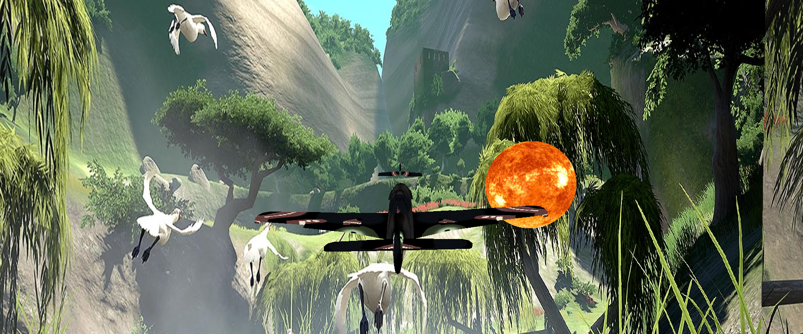

# Plane Simulator ✈️

This is a demo project to start implementing OpenGL applications using QT



<!-- TABLE OF CONTENTS -->

## :ledger: Index

<details open="open">
  <summary>Table of Contents</summary>
  <ol>
    <li>
      <a href="#beginner-motivation">Motivation</a>
    </li>
    <li>
     <a href="#hammer-built-with">Built With</a>
    </li>
    <li>
      <a href="#zap-getting-started">Getting Started</a>
      <ul>
        <li><a href="#electric_plug-installation">Installation</a></li>
      </ul>
    </li>
    <li><a href="#fire-contributing">Contributing</a></li>
    <li><a href="#cactus-to-do-in-the-future">To-do in the future</a></li>
  </ol>
</details>

## :beginner: Motivation

* An Institut praktikum project in my 5th Semester at Uni. https://www.mmi.rwth-aachen.de/studieren/praktika/

* The goal of the project is the design and implementation of a simulated 3D world in software, in which virtual vehicles can follow simple control commands. The input of the commands shall be based on keyboards WASD

* The project focuses on methods of modern, agile software development in teams, as well as on applied object orientation. The programming language C++ is used with the frameworks and technologies Qt, OpenGL, as well as Git or Subversion for version control.

## :hammer: Built With

- C++
- OpenGl
- QT

<!-- GETTING STARTED -->

## :zap: Getting Started

### :notebook: Pre-Requisites

- QT version 5.12.2 or bellow (I tested with version 6x but the error is showing missing multimedia module)
- MinGW 7.3.0 32/64 bit
- 
### :electric_plug: Installation

```bash
git clone https://github.com/dkevin96/plane-simulator.git
```
In QT
```bash
1. Navigate to source folder
2. Run Qmake
3. Build
4. Run
```

In App
```bash
- U can use WASD to move around
- Spacebar to accelerate and move foward
- Use mouse to look around
```

<!-- CONTRIBUTING -->

## :fire: Contributing

Contributions are what make the open source community such an amazing place to be learn, inspire, and create. Any contributions you make are **greatly appreciated**.

1. Fork the Project
2. Create your Feature Branch (`git checkout -b feature/AmazingFeature`)
3. Commit your Changes (`git commit -m 'Add some AmazingFeature'`)
4. Push to the Branch (`git push origin feature/AmazingFeature`)
5. Open a Pull Request
